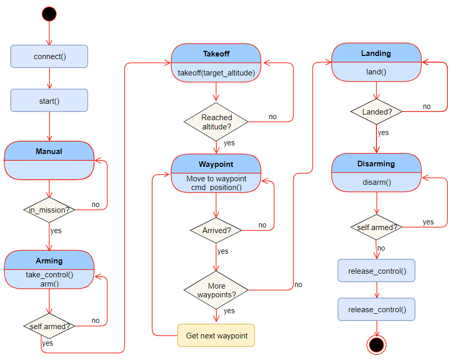

# FCND-P01-Backyard-Flyer
FCND-P01-Backyard-Flyer implements a state machine using event-driven
programming to autonomously fly a unmanned aerial vehicle (UAV) on
simulated environment.

The communication with the UAV is done using MAVLink.  This implementation
can be used to control PX4 quadcopter autopilot with little modification.

## File Structure
### Project Source Files
* [`backyard_flyer.py`](backyard_flyer.py) - event-driven program
that autonomously flies UAV for a given mission 

## Getting Started
### [Download ZIP](https://github.com/gabeoh/FCND-P01-Backyard-Flyer/archive/master.zip) or Git Clone
```
git clone https://github.com/gabeoh/FCND-P01-Backyard-Flyer.git
```

### Setup Environment
You can set up the environment following
[FCND-Term1-Starter-Kit - Miniconda](https://github.com/udacity/FCND-Term1-Starter-Kit/blob/master/docs/configure_via_anaconda.md).
This will install following packages required to run this application.
- Miniconda
- Python

Packages included through Miniconda:
- [`Matplotlib`](https://matplotlib.org/) - Python 2D plotting library
- [`Jupyter Notebook`](http://jupyter.org/) - Open-source web application
that allows you to create and share documents that contain live code, 
equations, visualizations and narrative text
* [`UdaciDrone API`](https://github.com/udacity/udacidrone) - Udacity Drone
Python API, which provides protocol agnostic API for communicating with
a quadcopter
  - To update, `pip install --upgrade udacidrone`
* [`Visdom`](https://github.com/facebookresearch/visdom/) - A flexible tool for creating, 
organizing, and sharing visualizations of live, rich data

### Using Anaconda
**Activate** the `fcnd` environment:
#### OS X and Linux
```sh
$ source activate fcnd
```
#### Windows
Depending on shell either:
```sh
$ source activate fcnd
```
or
```sh
$ activate fcnd
```

### Download Simulator
- Download Udacity Flying Car Simulator from
[this repository](https://github.com/udacity/FCND-Simulator-Releases/releases)

### Usage

#### Run Backyard Flyer Simulation
First, run _**Backyard Flyer**_ module from Flying Car Simulator.
Then, run the following command to perform the mission flight. 
```
$ python backyard_flyer.py 
```

#### Log Manual Fly
First, run _**Backyard Flyer**_ module from Flying Car Simulator.
Then, run the following command to perform the mission flight. 
```
$ python backyard_flyer.py 
```

## Project Report
### State Diagram


### Results
* Video Recording: [FC_BackyardFlyer_Recording_2019-11-14.mp4](FC_BackyardFlyer_Recording_2019-11-14.mp4)

### Reference
* Udacity Backyard Flyer project intro
    * https://github.com/udacity/FCND-Backyard-Flyer

## License
Licensed under [MIT](LICENSE) License.
